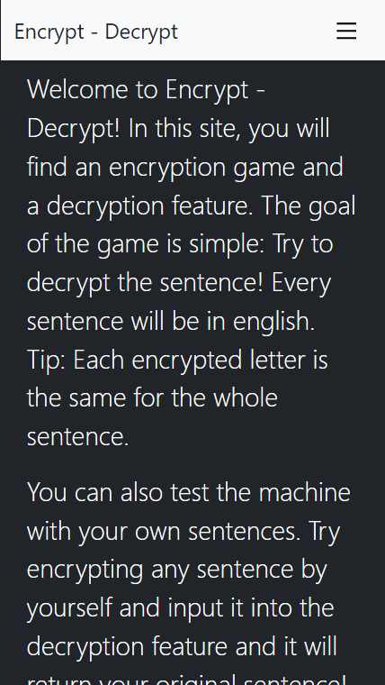
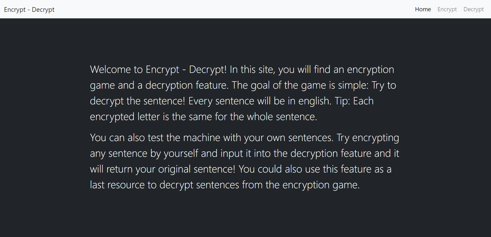

# Encrypt-Decrypt

This website contains two main sections: Encrypt and Decrypt. The Encrypt section features a fun game that allows the player to guess an encrypted word, letter by letter. The Decrypt section features a decrypting algorithm that allows the user to decrypt any sentence previously encrypted with the [Caesar cipher](https://en.wikipedia.org/wiki/Caesar_cipher). Built with React, Redux, and Bootstrap.

## Mobile

## Desktop

## Live Demo

[Live Demo Link](https://dicodiaz.me/encrypt-decrypt)

## Built With

- React
- Redux
- Bootstrap
- VSCode
- Git & GitHub

## Getting Started

To get this project up and running, follow these simple steps:

1. Clone the repository into your machine (Or download the .zip file and extract).
2. Open the project's folder in your preferred source code editor.
3. Run `npm install`
4. Run `npm start`

### Setup

Follow the steps described before.

## Authors

👤 **Dico Diaz Dussan**

- GitHub: [@dicodiaz](https://github.com/dicodiaz)
- LinkedIn: [Dico Diaz Dussan](https://www.linkedin.com/in/dico-diaz-dussan/)
- Portfolio: [dicodiaz.com.co](https://dicodiaz.com.co)

## 🤝 Contributing

Contributions, issues, and feature requests are welcome!

Feel free to check the [issues page](../../issues/).

## Show your support

Give a ⭐️ if you like this project!

## 📝 License

This project is [MIT](./MIT.md) licensed.
